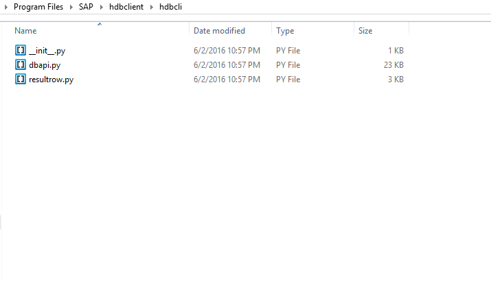
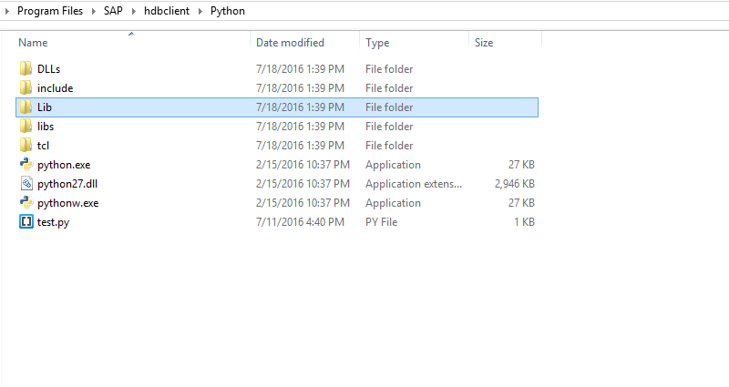
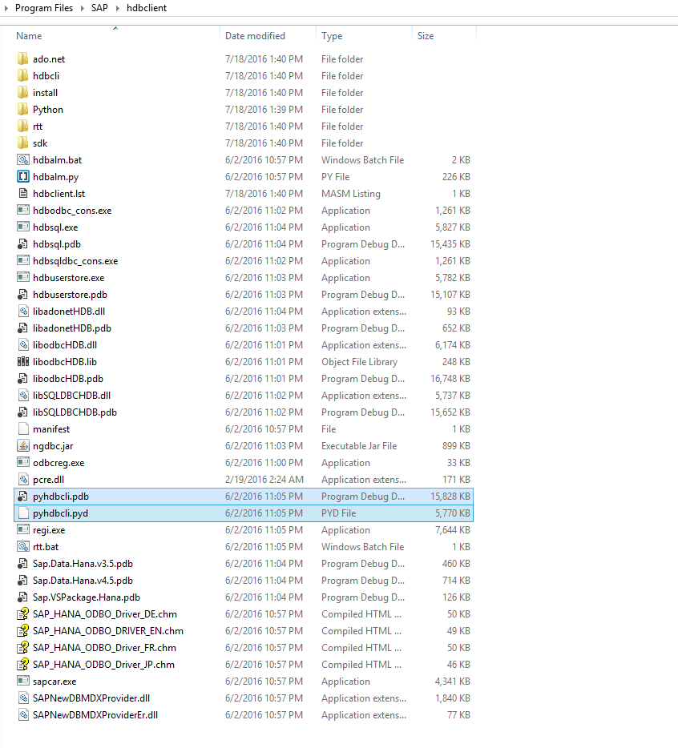

## Prerequisites  
 - **Setup:** This tutorial assumes that you have followed the [SAP HANA Client Installation and Update Guide](http://help.sap.com/hana/SAP_HANA_Client_Installation_Update_Guide_en.pdf) to install the HANA client software. You can download the HANA client software from [SAP Store](https://store.sap.com/sap/cpa/ui/resources/store/html/SolutionDetails.html?pid=0000012950).

## Next Steps
 - This is a standalone How-To on establishing basic connectivity to SAP HANA database server in python. [View similar How-Tos](http://go.sap.com/developer/tutorials.html) or [View all How-Tos](http://go.sap.com/developer/tutorials.html)


## How-To Details
In many python applications, you would need access to a database for storing, retrieving and other uses of data. In this How-To, you will use a sample database connection program using SAP HANA Client that provides python connectivity to SAP HANA libraries and executables.

### Time to Complete
**10 Min**.

---

1. Navigate to the path where **HANA client** is installed and then copy these three files `__init__.py, dbapi.py, resultrow.py`. By default, the SAP Client is installed at:

    Microsoft Windows :- `C:\Program Files\SAP\hdbclient\`

    Linux Platform :- `/usr/sap/hdbclient/`

    

2. Then go to the `Python` directory under `hdbclient` directory and paste all three files into the `Lib` directory.

    

3. Copy `pyhdbcli.pdb`, `pyhdbcli.pyd` files from `hdbclient` directory.

    

4. Do the same as step 2 above, paste the files into `Python/Lib` directory. Now you are done with the configuration part.

5. In this step, copy and paste the below code in an editor and save the file with the `.py` extension. In the below example, The port `3< instance number >15` matches to the tenant database named `HXE`.

    ```python
    import dbapi

    #Replace with your hostname, unique port for the database you are connecting,
    #UserID and password in that order.
    connection=dbapi.connect('hana-server', '30015', 'system', 'manager')

    #This statement prints true if the connection is successfully established
    print connection.isconnected()
    ```

6. Copy the file into `Python` directory of **HANA Client**  and execute in the same directory using command
    >`python filename.py`.

    Or if you are using python IDE, assign `python.exe` from the same directory as the python executable.

7. Run the program and if the program prints *True*, then the connection to SAP HANA database is successful.

## Next Steps
 - [View similar How-Tos](http://go.sap.com/developer/tutorials.html) or [View all How-Tos](http://go.sap.com/developer/tutorials.html)
