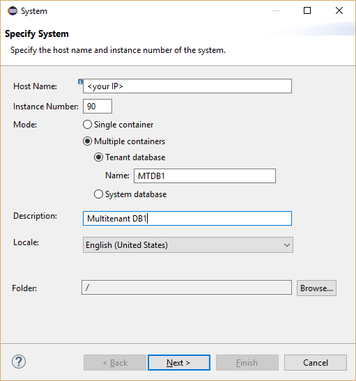

## Prerequisites  
 - Proficiency: beginner
 - Setup: `HANA, express edition` must be running.

## Next Steps
 - Go to the [`SAP HANA, express edition tutorials page`](http://www.sap.com/developer/topics/sap-hana-express.tutorials.html)


 __ NOTE: SAP HANA, express edition version 2.0 implications on 'How-Tos' and 'Tutorials' __

 The available HANA, express edition versions (1.0 SP12 and 2.0 SP00) have different default instance numbers. The published Tutorials and How-Tos refer to the default HANA 2.0 SP00 instance numbers. When using the SP12 version please use the old default instance number and port (3`<instance number>`15):

 HANA Express Version  | Default Instance ID | Port
 :-------------------  | :------------------ | :---------------
 1.0 SP12              |  00                 | 30015
 2.0 SP00              |  90                 | 39015

## How-To Details
Provides instruction on how to create a `multitenant` container database in `HANAExpress` and how to connect and verify the new database.

### Time to Complete
**5 Min**.

---

1. Connect to `HANA, express edition` using SYSTEM user and create a `multitenant` container database:

    ```
    % hdbsql -i 90 -n localhost:39013 -u SYSTEM -p <SYSTEM user password> "CREATE DATABASE MTDB1 SYSTEM USER PASSWORD <password>"
    ```

    This will take about 1 min, result will be similar to:

    

2. Verify the new `multitenant` container database is accessible:

    ```
    % hdbsql -i 90 -n localhost:39013 -u SYSTEM -p <SYSTEM user password> "select * from "PUBLIC"."M_DATABASES""
    ```

    

3. Verify that you can connect to the database using a HANA client tool such as `HANA Studio`. To do so, select the `Add System` command in `HANA Studio`:

    

    

    View from HANA Plugin for Eclipse after adding "MTDB1":

    


## Next Steps
 - Go to the [`SAP HANA, express edition tutorials page`](http://www.sap.com/developer/topics/sap-hana-express.tutorials.html)
