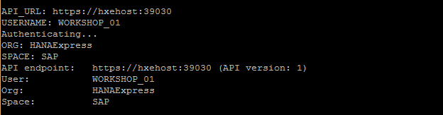

## Prerequisites  
 - Proficiency: beginner
 - Setup: This tutorial provides the details on creating required users for other `HANA, express edition` "Tutorials"

## Next Steps
 - Go to the [SAP HANA, express edition](http://www.sap.com/developer/topics/sap-hana-express.tutorials.html) tutorials page

 **Note on SAP HANA, express edition version 2.0 implications on "How-Tos" and "Tutorials":**


 The available HANA, express edition versions (1.0 SP12 and 2.0 SP00) have different default instance numbers. The published Tutorials and How-Tos refer to the default HANA 2.0 SP00 instance numbers. When using the SP12 version please use the old default instance number and port (3`<instance number>`15):

HANA Express Version  | Default Instance ID | Port
:-------------------  | :------------------ | :---------------
1.0 SP12              |  00                 | 30015
2.0 SP00              |  90                 | 39015

## How-To Details
The HANA, express edition "Tutorials" reference a set of users. This set of instructions assures all required users and passwords are available and correct before attempting the other `HANA, express edition` "Tutorials".

The passwords referred to in the "Tutorials" will not match passwords chosen by the user. For example, any reference to the password `"HANARocks2016"` should be replaced by the user provided password (see below).

### Time to Complete
**5 Min**.

---

1. Review default system configuration for `HANA, express edition`:

Field Name  | Value
:---------- | :---------------
System Host | `hxehost`
SID         | `HXE`
System Instance Number | `90` (version 1 SP12 `00`)
XSA Organization | `HANAExpress`
XSA Space   | `SAP`
ALL passwords | <user defined> (referred to as `HANAROCKS2016` in tutorials)


2. Create `WORKSHOP_01` user for `SAP HANA, express edition` "How-To" tutorials:

    - Login to `HANA` as `hxeadm`  (you may need to change system password if not already done) and create `WORKSHOP_01` user:

    ```
    % sudo su - hxeadm

    % xs login -u xsa_admin -p <password>
    ```

    Reminder: version 1.0 SP12 default instance number is 00, in below `hdbsql` command, replace "90" with "00".

    ```
    % hdbsql -i 90 -n localhost:39013 -u SYSTEM -p <SYSTEM user password>  "CREATE USER WORKSHOP_01 PASSWORD <password> NO FORCE_FIRST_PASSWORD_CHANGE SET PARAMETER XS_RC_XS_CONTROLLER_USER = 'XS_CONTROLLER_USER' , XS_RC_DEVX_DEVELOPER = 'DEVX_DEVELOPER', XS_RC_XS_AUTHORIZATION_ADMIN = 'XS_AUTHORIZATION_ADMIN'"
    ```

3. Add XSA "space role" for workshop user:

    ```
    % xs set-space-role WORKSHOP_01 HANAExpress SAP SpaceDeveloper
    ```

4. Verify the new `WORKSHOP_01` user can connect to `HANA, express edition`:

    ```
    % hdbsql -u WORKSHOP_01 -p <password> -d SystemDB -i 90
    ```

    Expected result:

    

5. Verify the `WORKSHOP_01` user can connect to XSA:

    ```
    % xs login -u WORKSHOP_01 -p <password>
    ```

    Expected result:

    

## Next Steps
 - Go to the [SAP HANA, express edition](http://www.sap.com/developer/topics/sap-hana-express.tutorials.html) tutorials page
