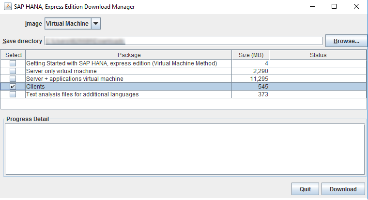

## Prerequisites
 - You (or someone in your organization) has already installed SAP HANA 2.0, express edition on another machine using either the [Installing Binary](http://www.sap.com/developer/tutorials/hxe-ua-installing-binary.html) or [Installing the VM Image](http://www.sap.com/developer/tutorials/hxe-ua-installing-vm-image.html) tutorial.

## Next Steps
 - [View similar How-Tos](http://www.sap.com/developer/tutorials.html) or [View all How-Tos](http://www.sap.com/developer/tutorials.html)

## How-To Details

Install the clients if you intend to develop XS applications on a machine that will not have a local SAP HANA 2.0, express edition installation. The clients let you access SAP HANA 2.0, express edition from your client machine.

You can install the clients on the SAP HANA 2.0, express edition server during server installation, but this how-to assumes you are installing the clients on a different machine than the PC where SAP HANA 2.0, express edition is installed.

This how-to refers to the laptop with SAP HANA 2.0, express edition as the **server machine**, and your local machine as the **client machine**.

### Time to Complete
**30 Min**.

---

### Download the Clients

Install the Download Manager to your client machine and download the client package.

> **Note:** The Download Manage requires Oracle Java SE Runtime Environment 8 (JRE 8) or higher, 64-bit, on your client machine.

1. Save the Download Manager installation file to your client machine and open it. For instructions on downloading and running the Download Manager, see either the [Installing SAP HANA 2.0, express edition (Binary Installer Method)](http://www.sap.com/developer/tutorials/hxe-ua-installing-binary.html) or [Installing SAP HANA 2.0, express edition (Virtual Machine Method)](http://www.sap.com/developer/tutorials/hxe-ua-installing-vm-image.html) tutorial

2. In Download Manager, in the **Image** pull-down, select either  **Virtual Machine** or **Binary Installer**.

   

3. Click **Browse** and select a directory where your client package will be saved.

4. Select only **Clients**. Clear the *Select* boxes of all other packages.

5. Click **Download**. The **`clients.zip`** file downloads to your save directory.

6. Extract **`clients.zip`**:

    - For Windows machines, use a compression utility like WinZip.

    - For Linux, navigate to the directory in which you wish to extract the client files and use the unzip command.

    ```
    cd <preferred_filepath>
    sudo unzip <download_filepath>/clients.zip
    ```

    These files are extracted:

    - `hdb_client_linux.tgz`

    - `hdb_client_windows.zip`

    - `xs.onpremise.runtime.client_linuxx86_64.zip`

    - `xs.onpremise.runtime.client_ntamd64.zip`

## Installing XS CLI Client

The XS advanced client-tools bundle **`xs.onpremise.runtime.client_<platform>-<version>.zip`** also includes the archive **``(xs_javascript-1.3.0-bundle.tar.gz)``**, which includes a selection of mandatory Node.js packages developed by SAP for use with the Node.js applications running in the XS advanced run time.

You can use the XS command-line client to perform a wide-variety of developer- and administrator-related tasks. For example, in the role of a developer, you can use the XS CLI to connect to the XS advanced run time installed on the server machine, log on as a specific user, deploy and manage your applications.

### XS CLI Client Prerequisites

- XS advanced is installed on the SAP HANA 2.0, express edition machine (the server host).

- You have access to the Internet from your client machine.

- You have logon access to the SAP HANA 2.0, express edition database with the privileges to create SAP HANA users (for example, SYSTEM).


### Install the XS CLI Client

Install the command-line client for XS advanced on your client machine.

In this procedure, you learn how to use the XS CLI to connect to SAP HANA, set up organizations and spaces for use by your development teams, assign roles to users in the organizations and spaces, create services, and bind services to the corresponding applications.

1. Using a compression utility such as WinZip or Unzip, extract either `xs.onpremise.runtime.client_ntamd64.zip` for Windows or `xs.onpremise.runtime.client_linuxx86_.zip` for Linux.

    The system will create this folder:

    ```
    xs.onpremise.runtime.client_<version>
    ```

2.  Check that the XS advanced run time is installed and available on the server machine.

    Enter the following URL in your Web browser:

    ```
    https://<hana_hostname>:3<instance>30/v2/info
    ```

    For example, the SAP HANA instance “90” on the host `xsa.acme.com`:

    ```
    https://xsa.acme.com:30930/v2/info  
    ```

    The response displayed in the Web browser is a JSON string with details that indicate a successful connection to the XSA controller. This connection test is important as you want to make sure the connection exists before you attempt it from within the API command.

3. Check that the XS client for XS advanced is installed and available.

    The XS client tools are required to connect to the XS advanced run time on SAP HANA and deploy your XS advanced applications.

    On your client machine, open a command window and run the following commands:

    ```
    sudo su -l <sid>adm
    xs help  
    xs -v
    ```

    If you see output indicated **Client version**, XS is installed.

4. Connect to the XS advanced controller on the SAP HANA 2.0, express edition server.   

    - Specify the URL of the API end point on the SAP HANA server you want to connect to:

    ```
    xs api https://<hostname>:3<instance_number>30
    ```

    > **Note**: This command may fail due to a missing SSL certificate. This note shows you how to set up a certificate on the client so it can connect to the server. Copy the correct certificate to your client from the SAP HANA 2.0, express edition server.

    > Open a command session on the server machine. From the command prompt, login as sudo and navigate to the certificate. The certificate `default.root.crt.pem` is typically located here:

    ```
    <installation_path>/<SID>/xs/controller_data/controller/ssl-pub/router
    ```

    > For example, where <installation_path>=/hana/shared and <SID>=HDB:

    ```
    /hana/shared/HDB/xs/controller_data/controller/ssl-pub/router/default.root.crt.pem
    ```

    > Copy the certificate to a folder on the server where you can easily access it.

    > Using an FTP client or the `scp` command, send a copy of the certificate from your server machine to your client machine.

    >`scp` example:

    ```
    scp <server_machine_user>@<ip_address_server>:<file_destination>/default.root.crt.pem <client_machine_user>@<ip_address_client>:<your_desired_filepath>/
    ```

    > Exit your Putty session and return to your client machine. Try the previous command again, but use the **`-cacert`** command and specify the local certificate you just copied.

    ```
    xs api https://<hostname>:3<instance_number>30 -caert <copied_filepath>/default.root.crt.pem
    ```


5. From the client machine, log on to the XS advanced run time.

    You log on to the SAP HANA instance specified in the API end point set in a previous step. SAP HANA provides a default user `XSA_ADMIN` with administrator permissions; you can use this user ID to test the logon. However, it is recommended to create a new user with more limited permissions, which you can use to log on for developer tasks.  

    ```
    xs login -u XSA_ADMIN -p <password>
    ```

    >**Note:** The password is assigned to the XSA_ADMIN user during SAP HANA 2.0express edition installation.

6. Test your connection to XSA. Run the following command to view XS applications on the SAP HANA 2.0, express edition server.

    ```
    xs apps
    ```

## Installing SAP HANA HDB Client

SAP HANA 2.0, express edition provides the **Reduced SAP Client** package for connecting applications. You can install the client on the server machine during server installation, or on a separate machine as described in this how-to.

### Available Clients

When you install the SAP HANA client software package, you install the following clients:

  - SQLDBC
  - ODBC
  - JDBC
  - Python (`PyDBAPI`)
  - Node.js
  - Ruby

### Install the SAP HANA Client (Windows)

To install the SAP HANA client on a Windows machine, use either a graphical user interface or a command line.

1. Using a compression utility like WinRAR or WinZip, extract `hdb_client_windows.zip`. (The file `hdb_client_windows.zip` is located in the `clients.zip` file you downloaded earlier in this how-to.)

    The following folders are created:
    ```
    hdb_client_windows\HDB_CLIENT_WINDOWS_X86_64
    ```

2. In file explorer go to the `HDB_CLIENT_WINDOWS_X86_64` folder.

   Or:

   Open a command prompt and navigate to `HDB_CLIENT_WINDOWS_X86_64`.

3. In file explorer, double-click:

    - **`hdbsetup.exe`** - GUI installation

    - **`hdbinst.exe`** - Command-line installation

    Or from a command prompt:

    Call the program `hdbsetup` (GUI installation) or `hdbinst` (command-line installation) by entering one of the following commands:

   Option        | Description
   :---------    | :--------
   GUI            | `hdbsetup [-a client]`
   Command Line  | `hdbinst [-a client] [<option list>]`

4. Follow the instructions displayed by the installation tool.

5. Add the installation path to the PATH environment variable. For information on setting environment variables, see the documentation for your operating system.

### Install the SAP HANA Client (Linux)

To install the SAP HANA client on a Linux machine, do the following.

1. Navigate to the directory where you wish to unpack the `hdb_client_linux.tgz` files.

    ```
    cd <your_destination>
    ```

2. Unpack `hdb_client_linux.tgz`:

    ```
    sudo tar -xvzf <unzipped_filepath/hdb_client_linux.tgz
    ```

    The directory `HDB_CLIENT_LINUX_X86_64`is created.

3. Move into the `HDB_CLIENT_LINUX_X86_64` directory and run `hdbinst`.

    ```
    cd HDB_CLIENT_LINUX_X86_64
    sudo ./hdbinst
    ```

    Follow the onscreen instructions to install the SAP HANA client.

### Logging the Installation

The SAP HANA client installation is automatically logged by the system. The log files are stored at `%TEMP%\hdb_client_<time_stamp>` for Windows or `/var/temp/hdb_client_<time_stamp>` for Linux.

### Connect SAP HANA Client to SAP HANA 2.0, express edition

Now that you've installed the SAP HANA Client, connect to an SAP HANA 2.0, express edition system.

See these `How-Tos`:

- [Connect to HXE using JDBC](http://www.sap.com/developer/how-tos/hxe-connect-hxe-using-jdbc.html)

- [How to connect to SAP HANA database server in Python](http://www.sap.com/developer/how-tos/hxe-python-connection.html)

### Uninstall the SAP HANA Client

Each installation has its own uninstallation tool. Use the `hdbuninst` command to uninstall the client software from your command prompt.

```
sudo <unzipped_filepath>/HDB_CLIENT_<version>/hdbuninst
```

Follow the onscreen instructions to uninstall the SAP HANA Client.

## Next Steps
- [View similar How-Tos](http://www.sap.com/developer/tutorials.html) or [View all How-Tos](http://www.sap.com/developer/tutorials.html)
