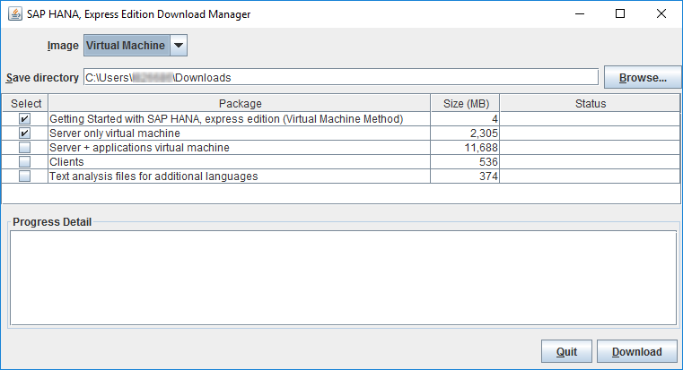
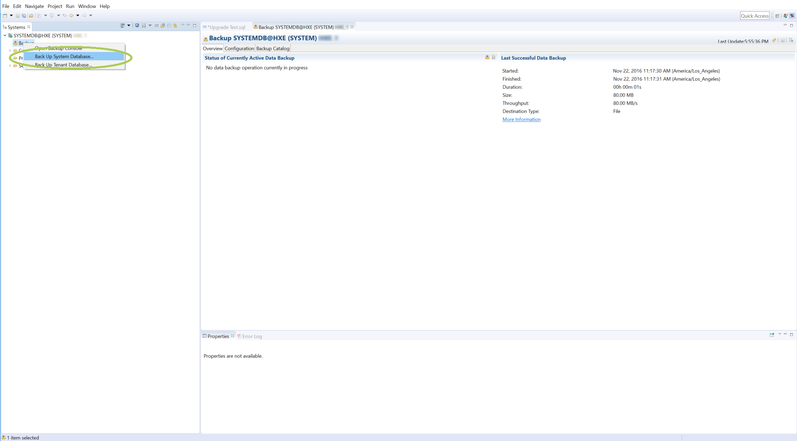
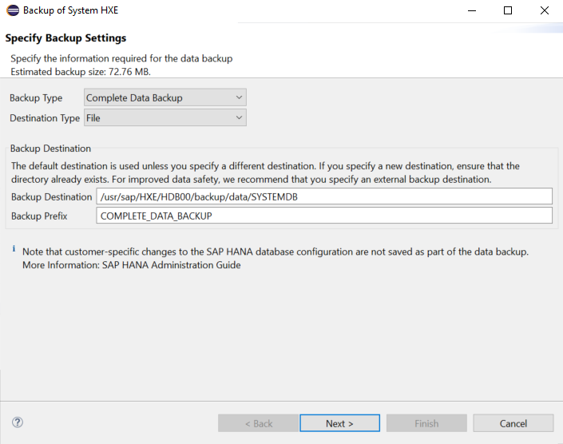

## Prerequisites
 - You (or someone in your organization) has installed SAP HANA 1.0, express edition their machine using the [Installing the VM Image](http://www.sap.com/developer/tutorials/hxe-ua-installing-vm-image.html) tutorial.

 - You have completed the [Start Using SAP HANA, express edition](http://www.sap.com/developer/tutorials/hxe-ua-getting-started-vm.html) tutorial and have successfully installed the SAP HANA Eclipse plugin.

- You have installed and successfully used an FTP client.

## Next Steps
 - [View similar How-Tos](http://www.sap.com/developer/tutorials.html) or [View all How-Tos](http://www.sap.com/developer/tutorials.html)

## How-To Details

If you wish to upgrade your SAP HANA, express edition installation from 1.0 to 2.0 without losing any data, follow this installation.

This installation assumes you have installed the SAP HANA 1.0, express edition VM image. To upgrade the SAP HANA 1.0, express edition binary installation, see [How to Upgrade to SAP HANA 2.0, express edition (Binary Installer)](http://www.sap.com/developer/how-tos/2016/12/hxe-ua-howto-upgrade-binary.html).

## Time to Complete
**15 Min**.

---

### Download SAP HANA 2.0, express edition VM image.

1. Register for your SAP HANA 2.0, express edition installation and download the Download Manager. For instructions on downloading and running the Download Manager, see either the [Installing SAP HANA 2.0, express edition (Binary Installer Method)](http://www.sap.com/developer/tutorials/hxe-ua-installing-binary.html) or [Installing SAP HANA 2.0, express edition (Virtual Machine Method)](http://www.sap.com/developer/tutorials/hxe-ua-installing-vm-image.html) tutorial.

2. In Download Manager, in the **Image** pull-down, select **Virtual Machine**.

    

3. Click **Browse** and select a directory where your downloads will be saved.

4. Select one or more of the following packages:  

    - **Getting Started with SAP HANA, express edition (Virtual Machine Method)** - Selected by default. Downloads the getting started guide in PDF format.

    - **Server only virtual machine** - Downloads **`hxe.ova`**; a basic server-only package.  

    - **Server + applications virtual machine** - Downloads **`hxexsa.ova`**; the server plus XSA and Web IDE.  

    - **Clients** - Downloads a zip file containing four compressed client packages. Use the client packages to access developed express edition applications from a client PC. See <!-- [How to Install the SAP HANA, express edition Clients] (http://www.sap.com/developer/how-tos/hxe-ua-howto-installing-clients.html) --> for installation steps.

        - **`hdb_client_linux.tgz`** - Reduced HANA client for Linux 64 bit. Contains the HANA client package, drivers, and required licenses.

        - **`hdb_client_windows.zip`** - Reduced HANA client for Windows 64 bit. Contains the HANA client package, drivers, and required licenses.

        - **`xs.onpremise.runtime.client_linuxx86_64.zip`** - Command-line tools for Linux that enable access to (and control of) the SAP HANA XS advanced run-time environment.

        - **`xs.onpremise.runtime.client_ntamd64.zip`** - Command-line tools for Windows that enable access to (and control of) the SAP HANA XS advanced run-time environment.

    - **Text analysis files for additional languages** - For languages other than English and German, files required for the HANA Text Analysis function. (The text analysis files for English and German are already included in the **Server only virtual machine** and **Server + applications virtual machine** packages.)

5. Click the **Download** button.

### Back Up Your Current SAP HANA 1.0, express edition Files

1. Power on your current SAP HANA 1.0, express edition virtual machine server.

2. Back up your current system.

    1. Open the SAP HANA Eclipse plugin.

    2. Login to your SAP HANA 1.0, express edition server.

    3. Right click on "Backup" under the "Systems" window.

    4. Select "Back Up System Database..."

        

    5. For *Backup Type* select *Complete Data Backup* and for *Destination Type* select *File*. Select your preferred destination and prefix name for your backup. By default your system backup will create two files stored at `/usr/sap/HXE/HDB00/backup/data/SYSTEMDB` with the names `<backup_prefix>_databackup_0_1` and `<backup_prefix>_databackup_1_1`.

        

        > *Note*
        > Keep track of your *Backup Prefix* as it will be used later for recovery.

### Store Your Backup on Your Local Machine

1. Start your FTP client and connect to your SAP HANA 1.0, express edition server.

2. Transfer your SAP HANA 1.0, express edition server backup files to a secure location on your local machine.

3. Power off your SAP HANA 1.0, express edition server.

### Install SAP HANA 2.0, express edition and Recover Files

1. Load the SAP HANA 2.0, express edition .ova file onto your `hypervisor`.

2. Power on your SAP HANA 2.0, express edition server. You may wish to visit [Start Using SAP HANA 2.0, express edition](http://www.sap.com/developer/tutorials/hxe-ua-getting-started-vm.html) to complete your installation.

3. Using your FTP client, connect to your SAP HANA 2.0, express edition server and transfer your backup files from your local machine to the new server.

4. Login to your SAP HANA 2.0, express edition server.

5. Run the following command:

    ```
    HDBSettings.sh recoverSys.py --command="RECOVER DATA USING FILE ('<transferred_backup_filepath/backup_filenameprefix>') CLEAR LOG"
    ```

    Example:

    ```
    HDBSettings.sh recoverSys.py --command="RECOVER DATA USING FILE ('/usr/sap/HXE/HDB00/backup/data/SYSTEMDB/COMPLETE_DATA_BACKUP') CLEAR LOG"
    ```

    The restore process begins. When recovery is completed, your server's command prompt will read `recoverSys finished successfully: <timestamp>`.

6. Restart your server. Ensure that your files have been successfully restored.
