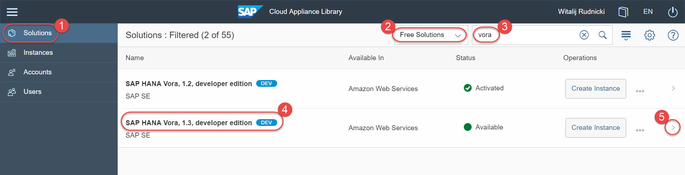
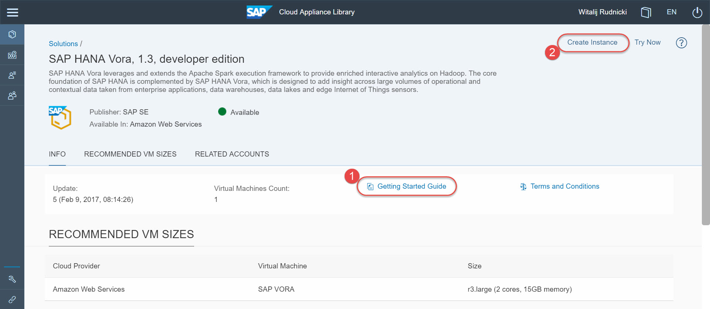
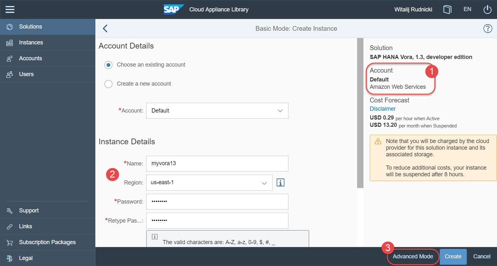
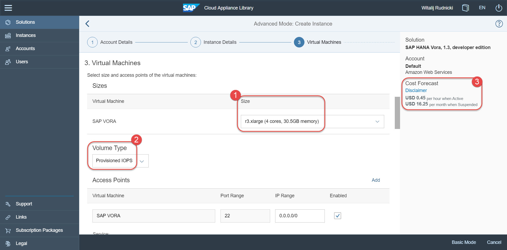
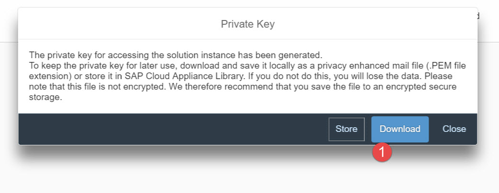
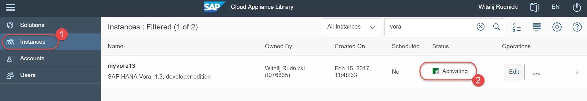
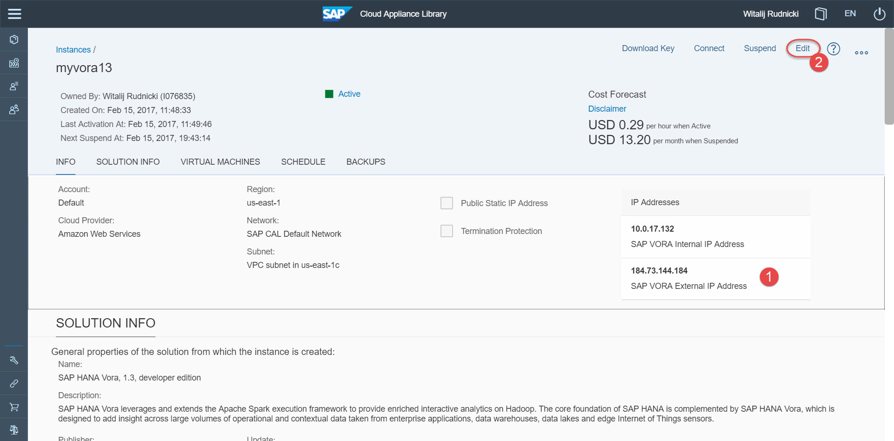
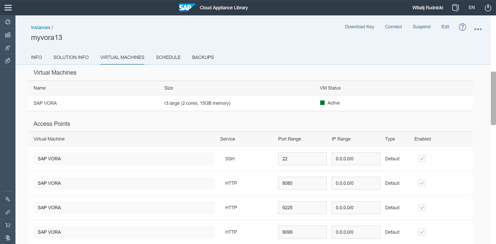
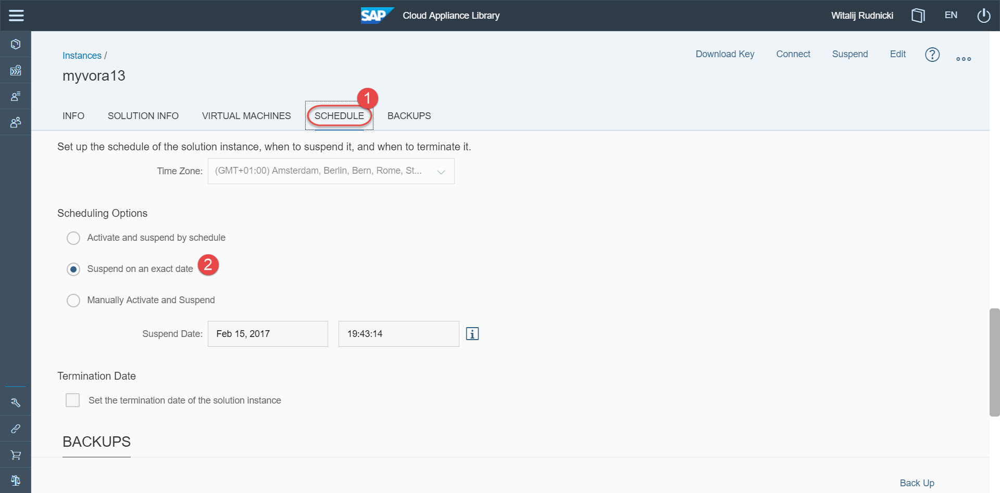
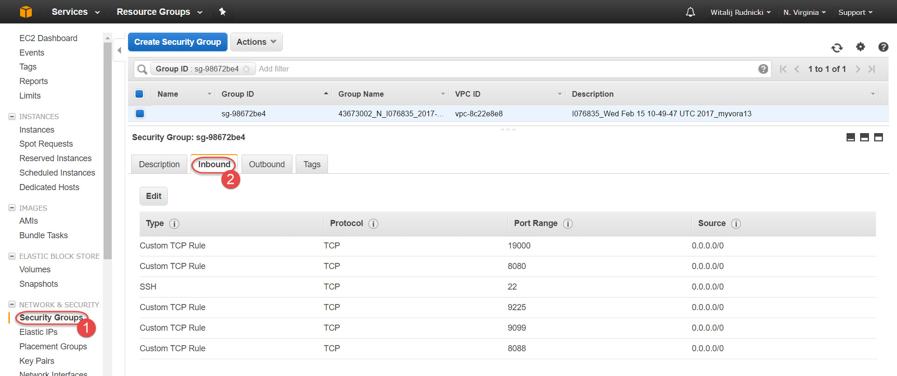

## Prerequisites  
 - **Systems used:**
   - You need to have an account on Amazon Web Services (AWS)
   - You have understanding of cloud infrastructure

## Next Steps
 - [Using Apache Zeppelin with SAP Vora](http://www.sap.com/developer/tutorials/vora-cal-zeppelin0.html)

## How-To Details
This How-to details the procedure to setup the SAP Vora 1.3 developer edition using the SAP Cloud Appliance Library.

SAP Vora, developer edition, is covered by the Developer License Agreement, which you will need to accept in order to be able to get access to it.

>SAP Vora is a software working in the **distributed environment**, i.e. the one that usually consists of at least several computing nodes. But in case of the **developer edition** the SAP Vora software has been modified to allow you to practice with a single node instance.

### Time to Complete
**60 Min**.

---

[ACCORDION-BEGIN [Step 1: ](Check you have proper access to SAP CAL)]

Currently the instance of SAP Vora developer edition can be created only in [Amazon Web Services](http://aws.amazon.com/account/). Make sure you have an account there.

The instance creation and management is done via [SAP Cloud Appliance Library](https://cal.sap.com/) - the free service to manage your SAP solutions in the public cloud. Make sure you have an account there before proceeding with this tutorial. Your AWS account should be properly configured and connected to your account in CAL.

>While SAP does not charge you for [developer editions of products](http://www.sap.com/developer/trials-downloads.html), Amazon will charge you for the usage of their infrastructure resources in the cloud, like computing, storage, network etc.

[DONE]
[ACCORDION-END]

[ACCORDION-BEGIN [Step 2: ](Locate the solution and create your own instance)]

In the CAL cockpit select **Solutions** to list all solutions available for your account. Reduce the list to **Free Solutions** and type `vora` in the search box.

Open the details of the `SAP Vora, 1.3, developer edition` solution. CAL's "solution" is the definition, and not yet the physical instance.

Review information about the solution, like descriptions, Terms and Conditions, template configuration etc.

Download and keep locally the **Getting Started Guide**. In this guide you will find important details, including software components and versions pre-installed, network configuration, default users and passwords etc. Review this document.

Click **Create Instance**.

On **Create Instance** screen choose the CAL account, where the instance to be created. In the example below the CAL account is `Default` and it is linked with the AWS account in Amazon Web Services.

Define:
- the instance name (here `myvora13`),
- the AWS region (here `us-east-1`, which is the only AWS region, where the instance can be created),
- the master password (make sure you remember it ;-).

Click **Advanced Mode** and go through the wizard steps. On step 3 **Virtual Machines** change SAP VORA machine size to at least `r3.xlarge` to make sure there will be enough resources for all processes.

To get better storage performance you can change as well the **Volume Type** to `Provisioned IOPS`. It has a cost impact, so choose what is more important for you. Review the cost forecast related to the instance. This is the cost charged by the cloud provider, which is AWS in this example.

At the end of the wizard click **Review** to review your settings, and then click **Create** if everything is good. Read and accept **Terms and Conditions** if displayed.

It is important that you click **Download** and store a file with a private key. You will use it to connect to the instance's host using ssh client of your choice, like [PuTTY](http://www.putty.org/).

The instance build will start. It should take about 45 minutes.

[DONE]
[ACCORDION-END]

[ACCORDION-BEGIN [Step 3: ](Review details of the created instance)]

Once your instance of SAP Vora is fully activated you can see it among your CAL's **Instances** with `Active` status.

Note the IP address of your host. It is the one used to connect to the instance services using e.g. `http(s)` and `ssh` protocols. The IP address will change every time you suspend (stop) and activate (start) the instance. To avoid that you can select `Public Static IP Address`, but remember that AWS is charging for using it even when the instance is suspended.

By default `Public Static IP Address` is not selected. This and other settings can be modified by clicking on the `Edit` in CAL cockpit. Or could be set already at the stage of the instance creation by choosing `Advanced Mode` instead of the `Basic Mode` you used in CAL.

`Access Points` define what host's ports are open. They influence the configuration of AWS's `Security Group` created for the instance. Changing instance's access points in CAL cockpit will automatically change the configuration of the corresponding security group in AWS.

Important thing is CAL's **Schedule** configuration. Using it will help you to save costs. The initial default schedule is configured during the instance creation in the CAL's Basic Mode. It can be edited.

Ideally you should remember to manually **Suspend** the instance every time you take a break in using the instance. This will stop the instance in AWS, so the cloud provider will not charge you for using resources when you do not work with SAP Vora.

[DONE]
[ACCORDION-END]

[ACCORDION-BEGIN [Step 4: ](Optional: Check your instance in AWS)]

You can see this instance as well in your AWS account in `N. Virginia` region. That's the same as `us-east-1` used during the instance definition in CAL.

As well you can see that CAL `Access Points` correspond to `Security Group` in AWS.

[DONE]
[ACCORDION-END]

## Next Steps
- [Using Apache Zeppelin with SAP Vora](http://www.sap.com/developer/tutorials/vora-cal-zeppelin0.html)
